Bienvenue dans l'application Pokémon ! Cette application a été développée en utilisant React Native et Redux, et elle tire parti de l'API PokeAPI pour fournir des informations sur les Pokémon.

## Fonctionnalités principales

- Affichage de la liste des Pokémon avec leurs noms et images.
- Recherche de Pokémon par nom.
- Affichage des détails d'un Pokémon spécifique, y compris son type, ses statistiques, etc.
- Fonctionnalité de pagination pour parcourir les différentes pages de résultats.
- Stockage des données d'API dans Redux pour une gestion centralisée de l'état de l'application.
- Utilisation de composants React Native pour une interface utilisateur réactive et conviviale.

## Installation

1. Clonez ce dépôt sur votre machine locale.
2. Assurez-vous d'avoir Node.js et npm installés sur votre système.
3. Exécutez `npm install` pour installer toutes les dépendances.
4. Exécutez `npm start` pour démarrer l'application.

## Technologies utilisées

- React Native
- Redux
- PokeAPI

## Structure du projet

- `src/` : Ce répertoire contient tout le code source de l'application.
  - `components/` : Composants réutilisables utilisés pour construire l'interface utilisateur.
  - `store/` : Contient les actions, les reducers et les slices Redux pour gérer l'état de l'application.
  - `screens/` : Écrans de l'application, organisés par fonctionnalité.
- `App.js` : Point d'entrée de l'application.

## La Maquette

Avant de commencer le développement de l'application, une maquette a été créée sur Figma pour visualiser et planifier l'interface utilisateur. La maquette a servi de référence tout au long du processus de développement pour garantir la cohérence du design.

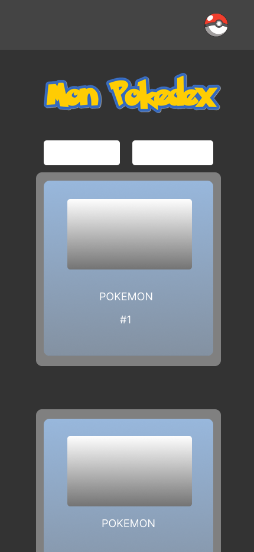

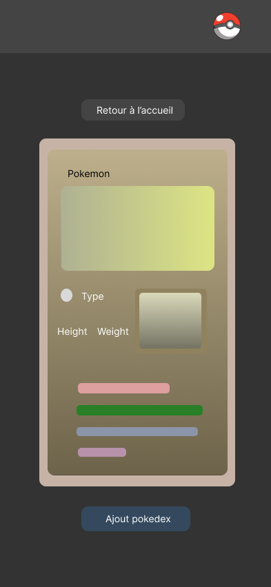

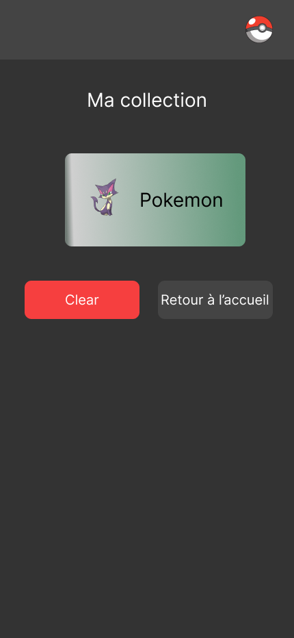

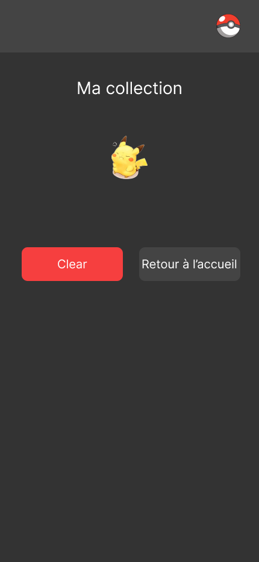

Les liens pdf sont disponible juste ici =>

[Homepage](./Figma/HomePage.pdf)
[DetailPokemon](./Figma/DetailPokemon.pdf)
[Collection](./Figma/Pokedex.pdf)

## Fonctionnalités

1. Afficher la liste des pokémons

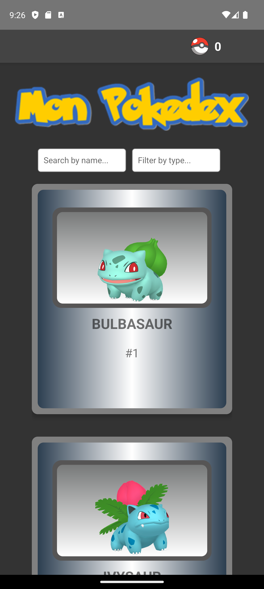
 
 1. a. Pagination

 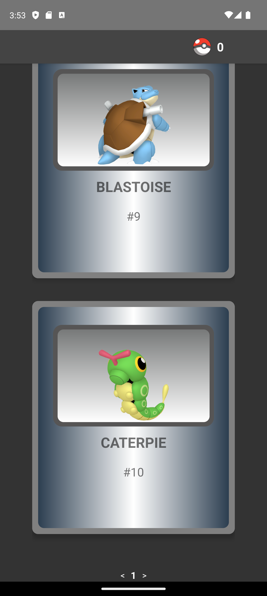

2. Filtrer par nom 

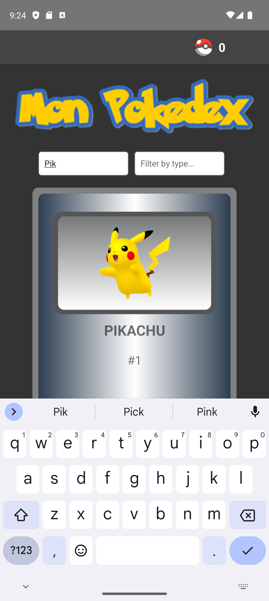
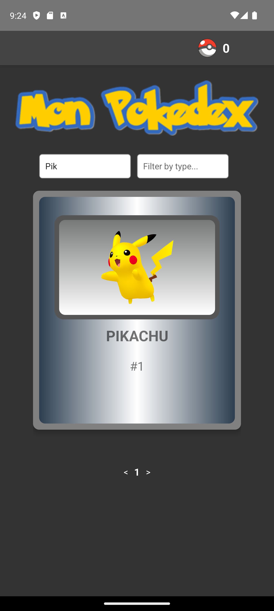

3. Afficher les details d'un pokémon

L'application permet d'afficher les détails d'un Pokémon sélectionné. Les détails affichés comprennent :
- Nom du Pokémon
- Points de vie (PV)
- Image du Pokémon
- Type du Pokémon
- Taille et poids du Pokémon
- Capacités du Pokémon
- Statistiques du Pokémon

**Étant donné que l'API PokeAPI ne fournit pas les images pour les types de Pokémon, j'ai pris l'initiative de personnaliser cette fonctionnalité.** 

**Pour ce faire, j'ai créé un fichier JavaScript (asset => typeImage.js) où j'ai stocké les images correspondant à chaque type de Pokémon.**

**Lorsque j'affiche les détails d'un Pokémon, je vérifie d'abord son type. Ensuite, j'utilise une condition pour sélectionner l'image appropriée à partir du fichier JavaScript que j'ai créé. Cela permet à chaque Pokémon d'afficher une image représentant son type, offrant ainsi une expérience visuelle plus riche et immersive.**

  Bouton Retour à l'accueil

J'ai également ajouté un bouton accueil pour faciliter la navigation.  
On peut également ajouté un pokemon au pokedex via le bouton 'Add to pokedex'

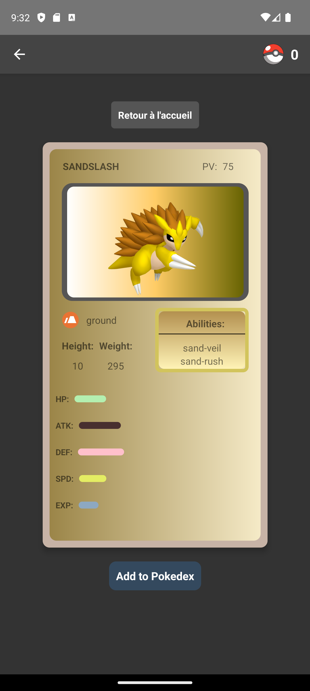

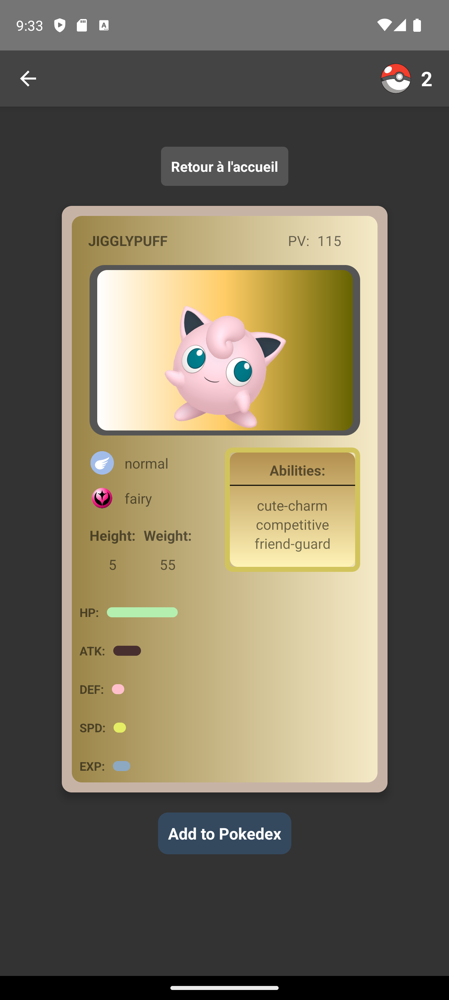

3.  Gestion de la collection

Dans l'application, j'ai ajouté une fonctionnalité de collection qui permet aux utilisateurs de suivre les Pokémon qu'ils ont ajoutés à leur collection. Lorsque je consulte ma collection de Pokémon, j'ai la possibilité de supprimer un Pokémon de ma collection et de revenir à l'accueil.

Pour supprimer un Pokémon de ma collection, je peux appuyer sur un bouton

Après avoir consulté ma collection de Pokémon, je peux facilement revenir à l'accueil en appuyant sur un bouton dédié. Cela me ramène à la page principale de l'application  
Lorsque je retourne à l'accueil après avoir supprimé un Pokémon de ma collection, je remarque que le Pokémon supprimé n'est plus affiché dans la liste des Pokémon. 

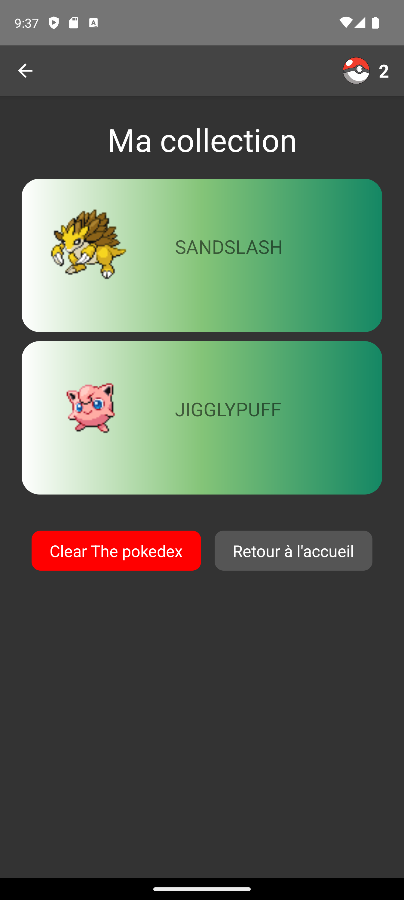
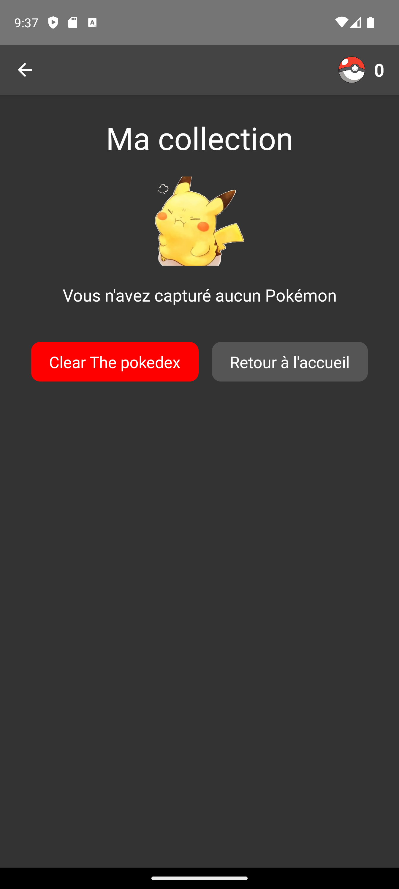

## Liens utiles

https://github.com/cindy5904/ECFReactNative

